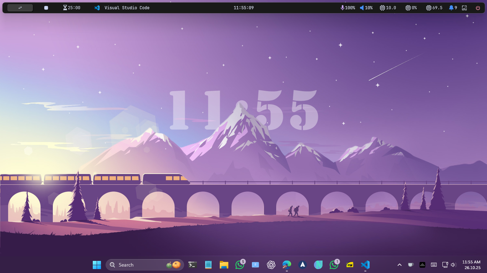

# DepthEffectClock

  
The lightweight fast depth effect clock. Mimic iOS depth effect.  
We don't use webtechnologies and are ultra efficient.  
The total build doesn't exceed 200kb. The memory is about 45mb.    

# Download
See [release](https://github.com/neptotech/DepthEffectClock/releases/tag/1.0.0).    
**Note:** You need to have latest .NET Desktop Runtime 9.0.x, download one [here](https://dotnet.microsoft.com/en-us/download/dotnet/thank-you/runtime-desktop-9.0.10-windows-x64-installer) If you didn't have aldready  

# Installation and Use

- Make sure to turn of desktop icons, or place no icon below the opaque parts of clock,image.  
- The program is provided in portable format, with .net or without.  
- Extract the program to some path like "D:\DesktopClock"   
- Make transparent image overlay using windows photos or any other software.  
- edit config.json there("D:\DesktopClock\config.json")  
- A typical config looks like this  

**Edit this config properly with correct image paths,fonts..**
```
{
  "imagePath": ".\\overlay.png" /*transparent overlay(make background transparent in main wallpaper)*/,
  "wallpaper": ".\\background.jpg"/*main windows wallpaper*/,
  "textAlign": "centre"/*centre, left, right*/,
  "textColor": { "a": 100, "r": 255, "g": 255, "b": 255 },
  "globalFormat": "%time" /*can be like "Hello User %time"*/,
  "font": { "family": "Stencil", "size": 160, "style": "Bold", "unit": "Pixel" } /*go to C:\WINDOWS\Fonts in explorer*/,
  // position wrt screen center
  "dx": 0,
  "dy": -50,
  "taskbarGap": 50 /*crop bottom of image to allow taskbar visibility*/,
  // Useful formats, see table: https://learn.microsoft.com/en-us/dotnet/standard/base-types/custom-date-and-time-format-strings
  // Use 'Hello' inside "" to write text literally, e.g. "'Hello' dddd '\n' MMMM hh:mm:ss"
  "withSeconds": "hh:mm:ss",
  "withoutSeconds": "hh:mm",
  "showSeconds": false /*without seconds uses less cpu, but effect unnoticeable*/
}
```
- run "D:\DesktopClock\DesktopWidget.exe"  

# Run
```
dotnet run
```

# Build
```
dotnet publish -c Release -r win-x64 --self-contained false /p:PublishSingleFile=true /p:IncludeAllContentForSelfExtract=true
```